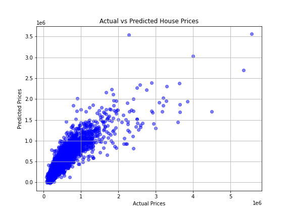

# 🏠 House Price Predictor

A simple machine learning project that predicts house prices using linear regression on real-world housing data.

---

## 📌 Overview

This project uses the **King County housing dataset** to build a predictive model for house prices. It demonstrates a basic end-to-end ML pipeline: data preprocessing, model training, prediction, and evaluation.

---

## 🧰 Technologies & Libraries Used

- Python
- Pandas
- NumPy
- Scikit-learn
- Matplotlib
- Seaborn
- Jupyter Notebook / Anaconda

---

## 📁 Files in this Repository

| File | Description |
|------|-------------|
| `house_price_model.ipynb` or `house_price_model.py` | Full code for model training and prediction |
| `kc_house_data.csv` | Dataset containing housing information |
| `README.md` | Project documentation |

---

## 🔍 Features of the Model

- Loads and preprocesses real-world housing data
- Encodes categorical variables (like zipcode)
- Trains a **Linear Regression** model
- Evaluates using **RMSE** and **R² score**
- Plots **Actual vs Predicted** house prices

---

## 🔢 Sample Output
Root Mean Squared Error (RMSE): 210345.65
R² Score: 0.685

 
*Sample scatter plot: actual vs predicted prices.*

---

## 📊 Dataset Used

**Name:** House Sales in King County, USA  
**Source:** [Kaggle Dataset](https://www.kaggle.com/datasets/harlfoxem/housesalesprediction)

---

## 🚀 How to Run

1. Clone the repo or download the files.
2. Open the Jupyter Notebook or Python script.
3. Make sure `kc_house_data.csv` is in the same directory.
4. Run all cells or execute the script.
5. Observe the model predictions and plots.

---

## 💡 Future Improvements (Optional)

- Add feature scaling
- Try other models like Ridge, Lasso, or Random Forest
- Deploy with Flask as a web app
- Add interactive input for users

---

## 🧑‍🎓 Author

**Nausha Tendulkar**  
*Aspiring AI/ML Developer | Java & Python Programmer*

---

